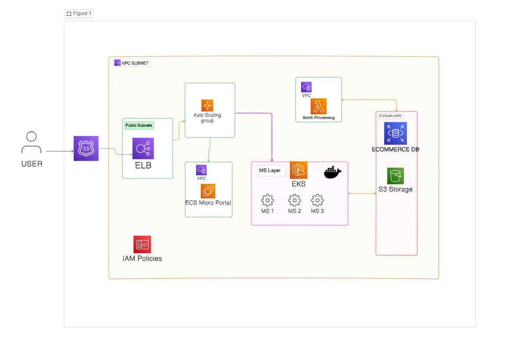
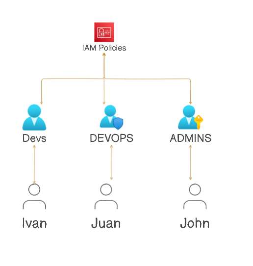

## lab11

### Part 1: Designing Cloud Infrastructure
* Design a cloud infrastructure for a scalable web application.
* Include components like compute instances, storage, and network configurations.
* Use AWS EC2, S3, and VPC to build the basic architecture.  

### Part 2: IAM Configuration
* Task:
* Define IAM roles and policies for different components of the architecture, such as developers, admins, and application servers.
* Ensure that each role adheres to the principle of least privilege

* For this IAM policy, we have defined a policy that allows the user to perform the following actions on the specified resources:
ROLE DEVS: Only they can access the S3 bucket and perform the specified actions (GetObject, PutObject, DeleteObject) on the objects in the bucket.
* Also can develop Micro Services using a Pipeline created in GitLab and deploy in the project.
* ROLE ADMINS:Can manage any resource in the AWS account, including creating, updating, and deleting resources. This policy grants full access to all AWS services and resources.
* Role DEVOPS: Can manage the EC2 instances, including starting, stopping, and terminating instances. This policy grants permissions to perform the specified actions on the specified resources. Aso they can configure all the things releated to the VPC and the security groups, Pipeline configurations, repositories, Create/Delete Tables in DynamDB and create/delete S3 Buckets.

### Part 3: Resource Management Strategy
* Task:
* Develop a strategy for managing resources that includes auto-scaling, load balancing, and cost optimization using AWS Auto Scaling, ELB, and AWS Budgets.

For this strategy, we have implemented the following components:
* Auto Scaling: We have configured auto-scaling for the EC2 instances to automatically adjust the number of instances based on the demand. This ensures that the application can handle varying levels of traffic without manual intervention.
* Load Balancing: We have implemented an Elastic Load Balancer (ELB) to distribute incoming traffic across multiple EC2 instances. This helps to improve the availability and fault tolerance of the application by ensuring that traffic is evenly distributed and that no single instance is overwhelmed.
* Cost Optimization: We have set up AWS Budgets to monitor and control costs associated with the resources used in the architecture. This helps to ensure that the project stays within budget and that costs are managed effectively. We have also implemented cost optimization strategies such as using reserved instances and spot instances to reduce costs where possible.
* Monitoring and Alerting: We have implemented Amazon CloudWatch to monitor the performance of the application and set up alarms to alert us of any issues or anomalies. This helps to ensure that the application is running smoothly and that any issues are addressed promptly.
* We have also implemented AWS CloudTrail to track user activity and API usage, providing visibility into who is making changes to the resources and what actions they are performing. This helps to improve security and compliance by providing an audit trail of all activity within the AWS account.

### Part 4: Theoretical Implementation

* Using the AWS services identified, outline the architecture for the web application. Describe how each component interacts with others, focusing on the flow of data and control between services. This description should detail the role of each service in the architecture, ensuring a clear understanding of their interactions and dependencies.
* The componenst start from a Route53 for redirect the traffic of our vpc Subnet in our Availability zone 1
* ELB for distribute the traffic between the instances of our EC2 and Auto Scaling group
* In a separate VPC we have our ECS with micro Portals that can scale on demand
* The MS Layer that contains a pipeline for deploy in containers the microservices and are orchestaded by the EKS
* In another VPC we have the BAtch Processing that also can sacale using Lambdas written in Python.
* In the storage Layer we have the S3 for the static content and the DynamoDB for the data of the microservices. Batch processing and Microservices are the only resorces that can access to this leyer.

### Part 5: Discussion and Evaluation
* **Discussion Points:**
* * Explain the choice of services and how they interact to provide a resilient and secure infrastructure.
* * Discuss how the designed IAM policies contribute to overall security.
* * Review the resource management strategy to ensure it meets the scalability and cost-efficiency needs.

* We select all the component menthioned in the point #4 because they are the best services that AWS can offer to us for the project. They are scalable, secure and cost-effective.
* The IAM policies are designed to follow the principle of least privilege, ensuring that each role has only the permissions necessary to perform its specific tasks. This helps to reduce the risk of unauthorized access and ensures that resources are protected from misuse.
  * The resource management strategy is designed to ensure that the architecture can scale to meet the demands of the application while also optimizing costs. By using auto-scaling, load balancing, and cost optimization strategies, we can ensure that the application is both scalable and cost-effective. The monitoring and alerting components help to ensure that the application is running smoothly and that any issues are addressed promptly. The use of AWS Budgets helps to ensure that costs are managed effectively and that the project stays within budget.
  * Overall, the architecture is designed to be resilient, secure, and cost-effective, providing a solid foundation for the web application to run smoothly and efficiently.
  * We have a complete infrastructure that suport the project scaling as needed and the development team has a modern pipeline for automate the deployments.
  * The roles of IAM are defined for provide only the access per role.
  * 

