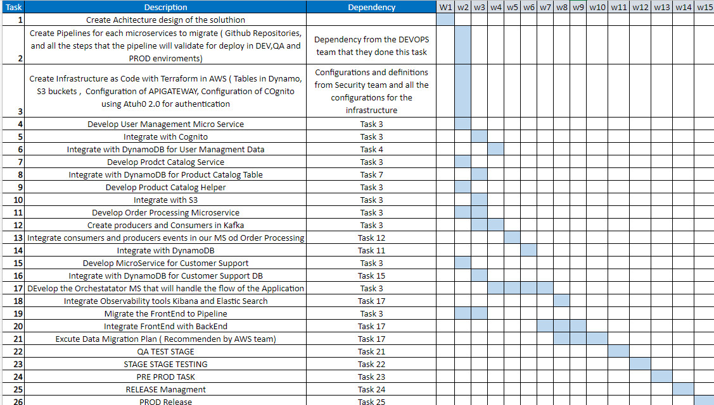
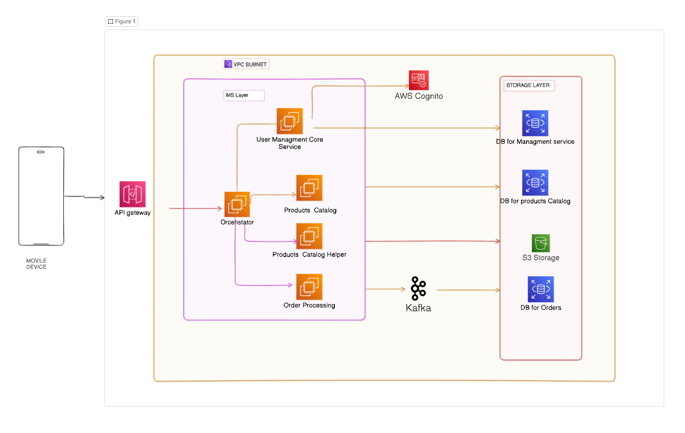

# Lab 9

# Overview:
This lab session challenges participants to apply their knowledge from previous lessons on microservices architecture. Participants will design a microservices architecture for a hypothetical application and simulate the decomposition of a monolithic application into microservices. This practical exercise aims to solidify understanding by tackling real-world problems and simulating the migration process.

## Objectives:
* Design a microservices architecture based on a given set of requirements.
* Simulate the decomposition of a monolithic architecture into microservices.
* Reflect on the design decisions and discuss alternative approaches.

## Monolithic E-Commerce Application Description:
The application is a traditional e-commerce platform that encompasses all functionalities within a single, unified software architecture. The application handles the following key operations:

* **User Management:**  Manages user profiles, authentication, and authorization. It stores personal information, manages login sessions, and handles user preferences.
* **Product Catalog:**  Maintains a comprehensive list of products, including descriptions, pricing, images, and inventory levels. It supports product search and categorization functionalities.
* **Order Processing:** Manages all aspects of the ordering process, from cart management to order placement, payment processing, and order history tracking.
* **Customer Support:** Handles customer inquiries, returns, complaints, and feedback through a ticket-based system integrated with the user and order databases.

The application is built on a single relational database that holds all user data, product information, orders, and customer support interactions. It currently operates on a single code base with a web-based frontend that communicates directly with the backend server.

The platform has been experiencing challenges with scaling during high-traffic periods, frequent downtimes during updates, and increasing difficulty in implementing new features without affecting existing functionalities. The goal is to decompose this monolithic architecture into a microservices-based architecture to address these issues and improve overall agility and scalability.

## Migration Roadmap
The migration process will involve decomposing the monolithic application into a set of microservices that encapsulate specific functionalities. The migration roadmap includes the following steps:

1. **Road map:** For the below roadmap we can follow the below group ob task that we need make for achieve the migration 

## Architecture Documentation

* **Architecture decisions:**

For the Below architecture we can see the different services that we need to implement for the migration of the monolithic application to a microservices' architecture.
* I decide split in 5 Microservices for lave to each one the responsability of the different functionalities of the application.
* **Orchestration:** This service will be the main service that will be in charge of managing the different services and the communication between them.
* **USer Management** Core service: This service will be in charge of managing the user data, authentication and authorization.
* **Product Catalog Core service:** This service will be in charge of managing the product data, product search and categorization functionalities.
* **Product Catalog Helper service:** This service will be in charge of managing the product images and inventory levels.
* **Order Processing Core service:** This service will be in charge of managing the order data, cart management, order placement, payment processing and order history tracking.

Also, as Infrastructure of AWS we are integration an API Gateway that will be in charge of managing the different endpoints of the different services and the communication between the services and the clients.
* **AWS Cognito:** This service will be in charge of managing the user authentication and authorization. Will work close with User managment core Service.
* **Kafka:** This service will be in charge of managing the communication between the Order processing MS and the DataBase of Orders  and handle the Asyncronous communication between the services.
* All this infrastructure is isolated by a VPC and only petitions can be made through the API Gateway and the front end app  that was configured in a whitelist.
