# Evidencia Laboratorio 1

## 1. Objetivos  Branch Strategy Simulation

Actualizo el archivo con los cambios a modificar
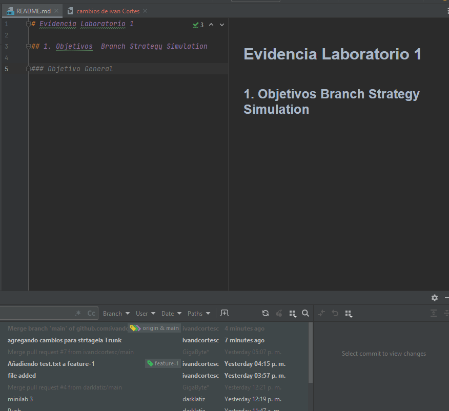

Pongo en stage los cambios

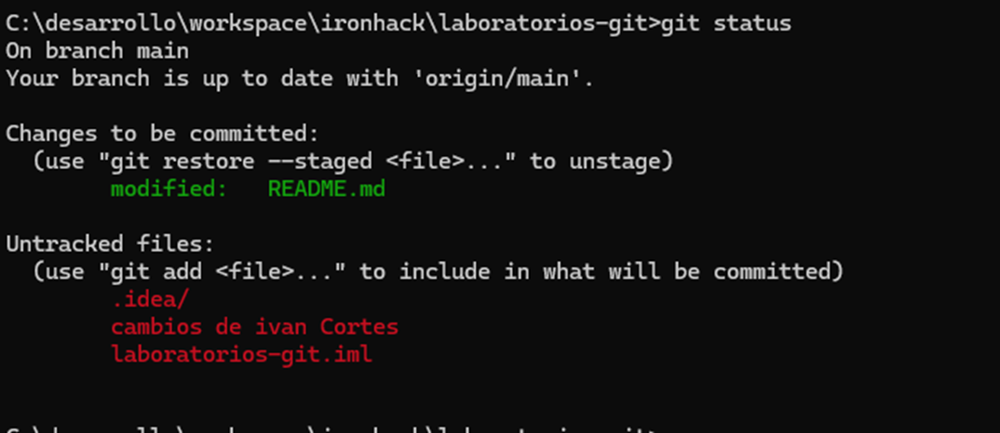

Hago un commit con los cambios
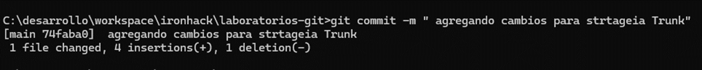
Intento subir  cambios pero  hay cambios en el remoto que no tengo en local. 
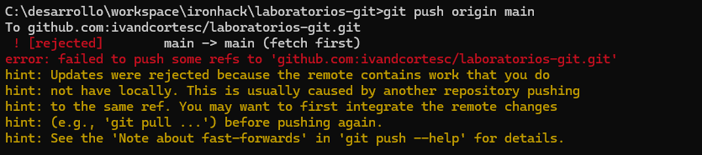
Hago un pull para traer los cambios del remoto y los mando al remoto
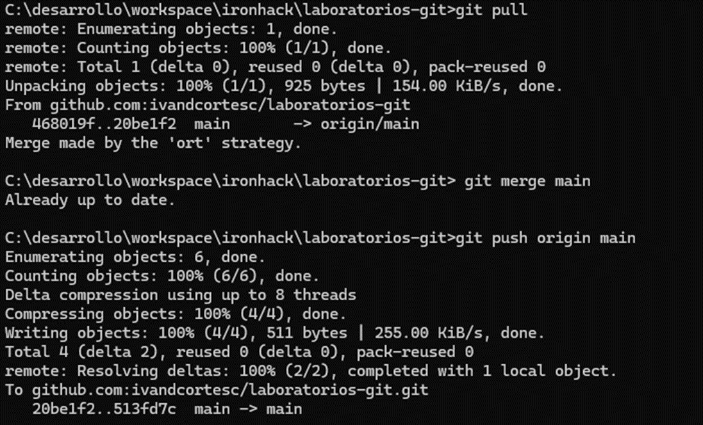
Evidencia de cambios en main en remoto
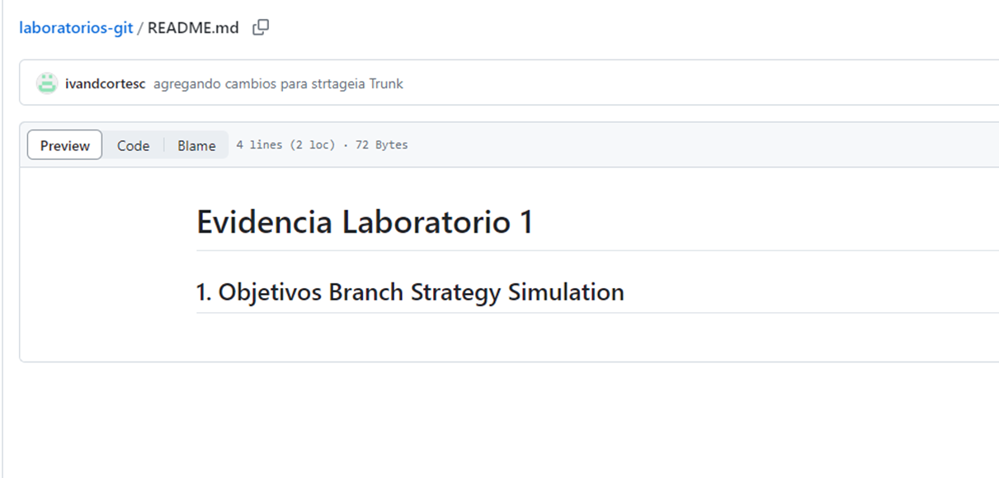

## 2.- GitFlow
Se crea rama develop

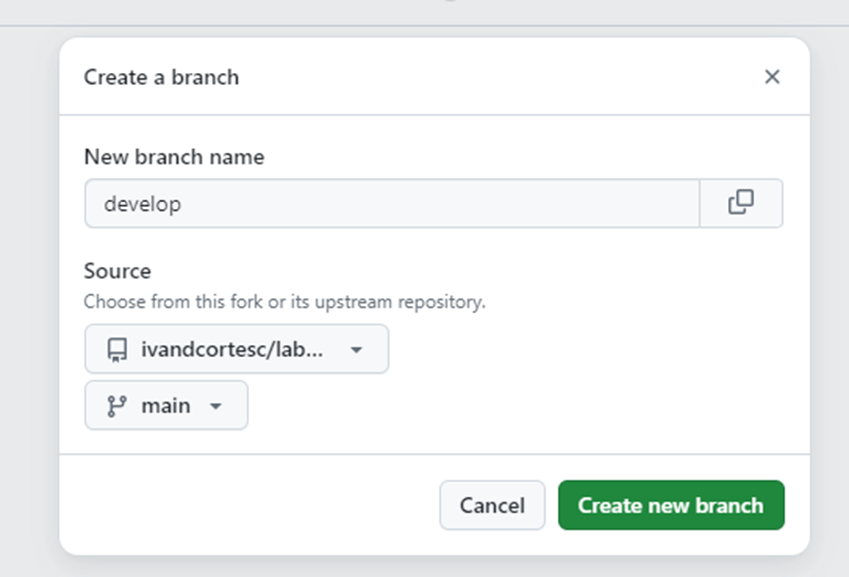

creo la rama develop
C:\desarrollo\workspace\ironhack\laboratorios-git>git checkout -b develop
Switched to a new branch 'develop'

Creo  el branch feature-lab-1 comp copia de develop
C:\desarrollo\workspace\ironhack\laboratorios-git>git checkout -b feature-lab-1 develop
Switched to a new branch 'feature-lab-1'

Modifique los archivos ReadME.md y agrego una imagen img_7.png

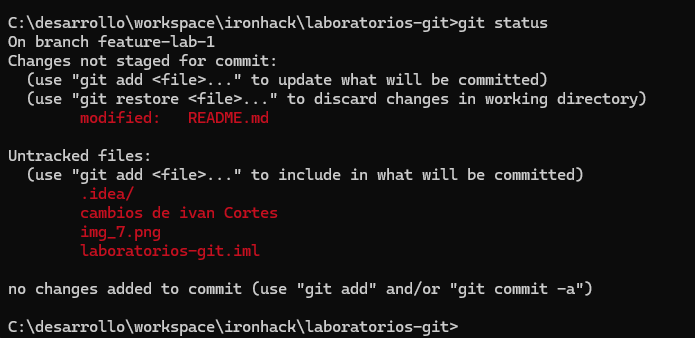

Agrego los archivos a stage , hago commit a la feature branch, me cambio a develop y hago merge de los cmabios.

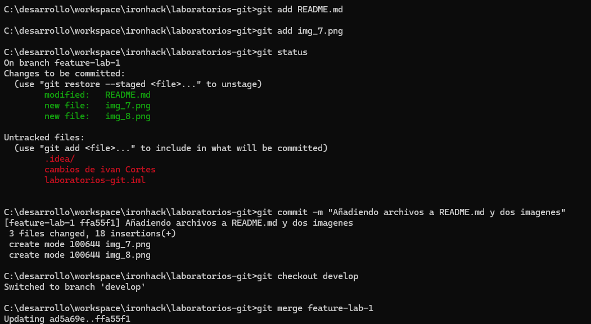

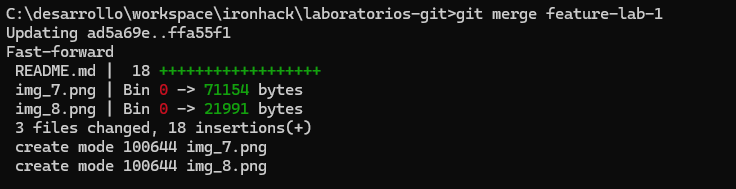

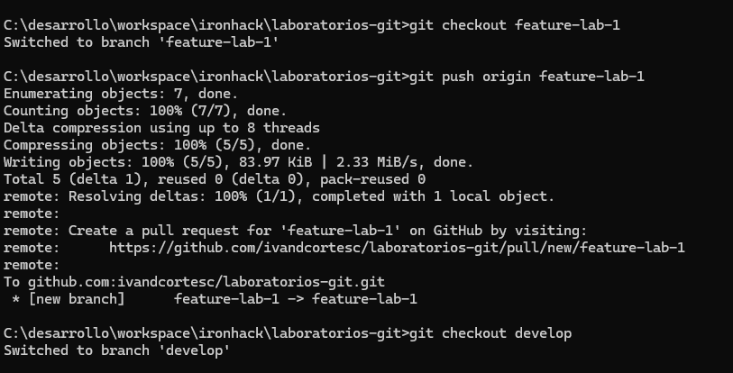
Continuo con el flujo de mergear mis cambios a develop y luego a main
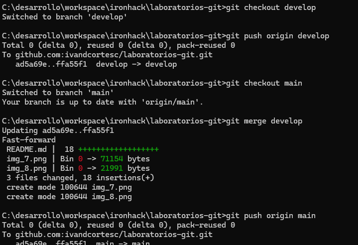

## 3.- GitFlow con conflicto

Este texto solo esta agregado en la rama  conflict-branch

