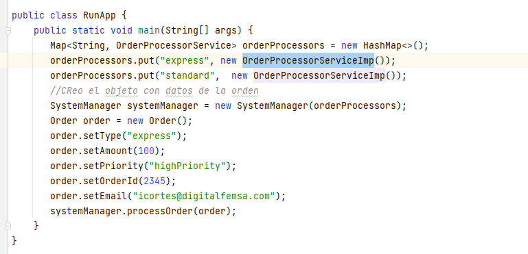
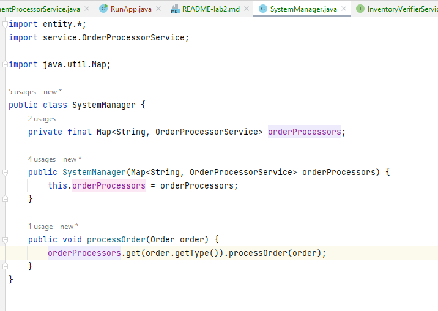
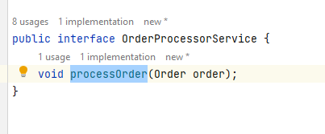
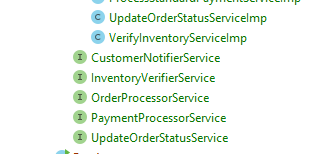
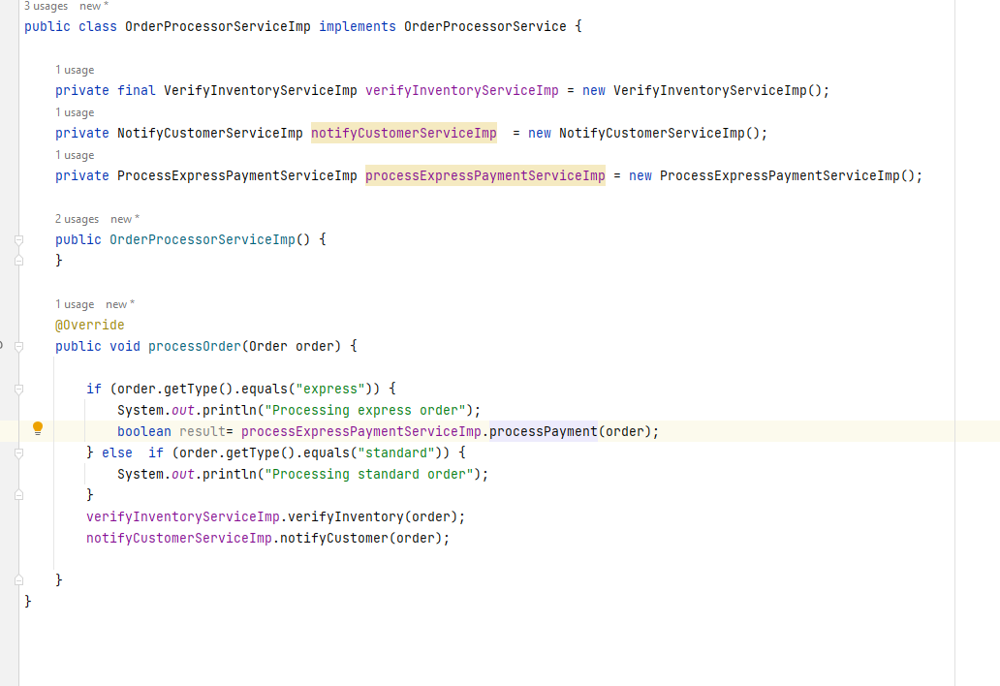

# Evidencia Laboratorio 2

## 1. Errores en el codigo original

En la clase  SystemManager se viola el principio SRP

              class SystemManager {
                  processOrder(order) {
                    if (order.type == "standard") {
                            verifyInventory(order);
                            processStandardPayment(order);
                          } else if (order.type == "express") {
                           verifyInventory(order);
                         processExpressPayment(order, "highPriority");
              }

           updateOrderStatus(order, "processed");
                notifyCustomer(order);
           }

-  Si se quiere agregar un nuevo tipo de pago, se debe modificar el metodo processOrder, lo que viola el principio de SRP.
-  Tambien se depende de implementaciones concretas como son paymentService, expressPaymentService, database y emailService, lo que viola el principio de DIP.  

        verifyInventory(order) {
            // Checks inventory levels
            if (inventory < order.quantity) {
                throw new Error("Out of stock");
            }
        }

        processStandardPayment(order) {
            // Handles standard payment processing
            if (paymentService.process(order.amount)) {
                return true;
            } else {
                throw new Error("Payment failed");
            }
        }

        processExpressPayment(order, priority) {
            // Handles express payment processing
            if (expressPaymentService.process(order.amount, priority)) {
                return true;
            } else {
                throw new Error("Express payment failed");
            }
        }

        updateOrderStatus(order, status) {
            // Updates the order status in the database
            database.updateOrderStatus(order.id, status);
        }

        notifyCustomer(order) {
            // Sends an email notification to the customer
            emailService.sendEmail(order.customerEmail, "Your order has been processed.");
        }
    }

## 2 Refactorizacion
-- Correr clase RunApp
- En la clase RunApp Se inicializan los objetos  con datos y se llama al metodo ProcessOrder de la clase SystemManager

- Se crea la clase SystemManager y solo se invoca a la implementacion para procesar los pagos

- Se crea la interfaz OrederProcesorService  y ahi se crea el metodo processOrder para procesar las ordenes
- 
- Se crean 4 interfaces mas para UpdateOrderStatusService, PaymentProcessorService , InventoryVerifierService y CustomerNotifierService con sus respectivos metodos para invocar cada uno de las operaciones y separandolas por funcionalidad 
- 

En la clase ProcessExpressPaymentServiceImp y ProcessStandardPaymentServiceImp se implementan los metodos de las interfaces PaymentProcessorService y se invocan los metodos de las interfaces InventoryVerifierService, UpdateOrderStatusService y CustomerNotifierService

-Lo que buscamos cubrir con todos estos cambios es SRP ya que las clases y metodos tienen solo una responsabilidad.
- OCP estan abiertas a extensiones y cerradas a modificaciones, ya que si se quiere agregar un nuevo tipo de pago, solo se debe crear una nueva clase que implemente PaymentProcessorService y no se debe modificar ninguna clase existente.
- DIP: La clase ProcessExpressPaymentServiceImp no depende de una clase concreta, solo depende de la entidad Order y de una interfaz.

