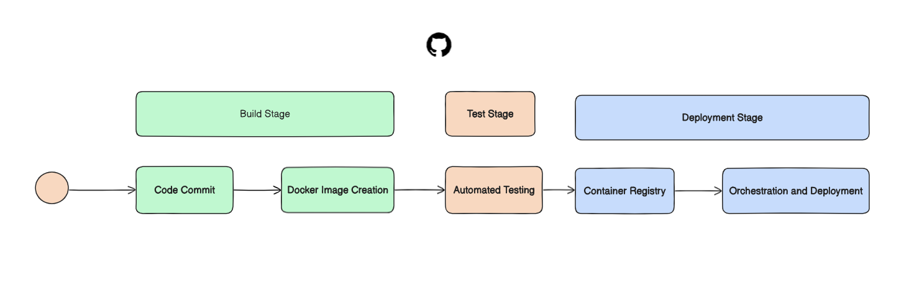
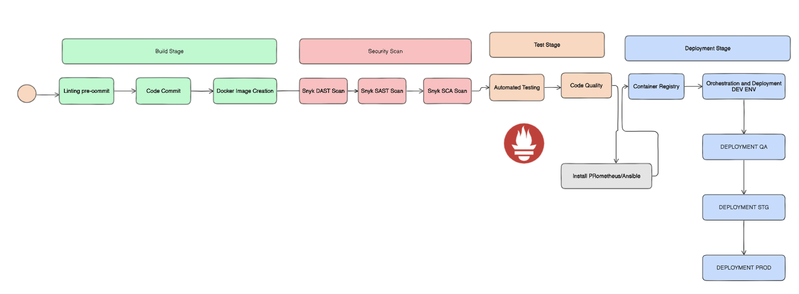

## 1.-Review Simulated CI/CD Pipeline Configuration:

En el diagrama observamos que el pipeline de CI/CD esta compuesto por 3 etapas principales:
Build Stage, Test Stage y deployment Stage.
Si bien es un pipeline funcional no considera mas stages como , revisar en un pre comit temas de CheckStyle o PMD, Code Queality, Code Coverag y scaneo de imagenes y codigo por pruebas de seguridad

## 2.-Analyze Enhancements and Potential Issues:

### 2.1 Enhancements:
En el siguiente diagrama se muestra como se podria mejorar el pipeline de CI/CD, agregando mas stages y herramientas para mejorar la calidad del codigo y la seguridad de la aplicacion.
* Se agrega stage Linting pre commit: La primera validacion para revisar temas de Checkstyle de codigo y PMD.
* Se agrega stage de Security Scan pruebas  DAST, SAST y SCA.
* Se agrega stage de Code Quality para revisar Code Coverage y Code Quality (Sonar).
* Se agrega stage de Monitoreo mediante Prometheus para hacer Sanity checks de los pods.
* Al utilizar GitFlow, se puede desplegar entre ambientes dev--> QA --STG --> PROD, solo empujando la imagen hacia los distintos ambientes mendiante PR. 

Docker encapsula todas y cada una  de las aplicaciones embebidas en la imagen.

### 2.2 Potential Issues:
Issues potenciales que podrian surgir al integrar Docker en el pipeline de CI/CD:
* Seguridad: Si la imagen no esta bien configurada podria tener vulnerabilidades.
* Orquestacion: Al tener muchos servicios podria ser dificil de orquestar y manejar los contenedores.
* Escalabilidad: Si no se tiene un buen monitoreo y escalabilidad podria tener problemas de rendimiento.
* Costos: Si no se tiene un buen control de los recursos podria tener un costo elevado.
* Solucion: Utilizar herramientas como Kubernetes para solucionar el tema de Orquestacion y monitoreo.
    
    
## 3. Write an Analysis Report:
* Docker al ser un contenedor, encapsula la aplicacion y sus dependencias, lo que permite que la aplicacion se ejecute de manera consistente en cualquier entorno, ademas de ser portatil y escalable.
* Pero tambien podria tener problemas de seguridad, ya que si la imagen no esta bien configurada podria tener vulnerabilidades, ademas de que al tener muchos servicios podria ser dificil de orquestar y manejar los contenedores.
* Por eso siempre es importante tener un buen monitoreo(Prometheus) y seguridad en las imagenes (Security Scans) y contenedores y ayudarnos de herramientas como Kubernetes para solucionar el tema de Orquestacion.
* La ventaja de tener las aplicaciones y todas la herramientas contenerizadas  es que cada que haya una modificacion de codigo, esta imagen y sus apps configuradas, tengan que pasar por el proceso del pipeline, desde Secutiry Scans hasta Code Quality.
